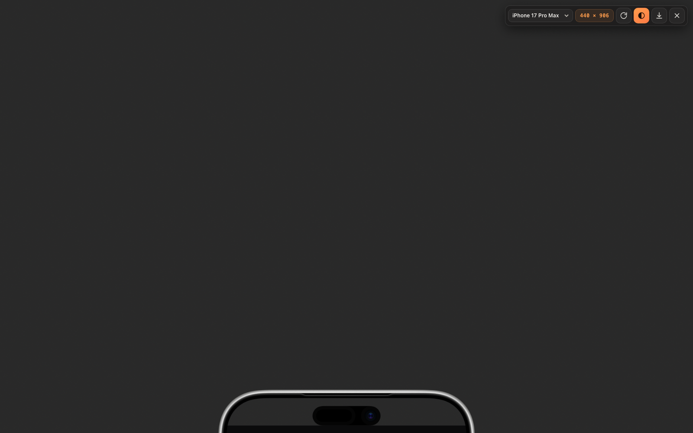

# Device Frame

A tiny Chrome (Manifest V3) extension that wraps the **current tab** in a realistic device bezel - iPhone, iPad, MacBook, iMac, Studio Display, Galaxy Z Fold, Apple Watch - so you can see any page as if it were running on that device, live, on top of the real page.

Click the toolbar icon once to frame the tab, click again (or press <kbd>Esc</kbd>) to clear it. No new tab, no separate window: a full-screen studio overlay drops over the current page with the site rendered inside the device at its true logical resolution.



## Features

- **Live tab, framed** - the page you are on, running inside a real device body (an `<iframe>` at the device's logical viewport).
- **Photoreal Apple frames** - high-resolution device PNGs with the live site composited into the transparent screen area using exact per-frame insets: **iPhone 17 Pro Max**, **iPad Pro 13" (M4)** (portrait + landscape), **iPad (A16)**, **MacBook**, **iMac 24"**, **Studio Display**.
- **iOS Safari chrome** on the iPhone - black status bar (9:41, cellular, Wi-Fi, battery) and a Safari bottom bar with the framed page's real domain (`Aa`, lock, URL, reload) plus the toolbar row (back, forward, share, bookmark, tabs). The page is inset between the two so nothing overlaps.
- **Rotate** to landscape - the iPhone synthesizes landscape by rotating the portrait frame 90 degrees and keeps the same on-screen size; the iPad ships a dedicated landscape frame.
- **Drawn (CSS) frames** for devices with no photoreal asset: Galaxy Z Fold (open), Apple Watch Ultra (orange band), and a Custom size.
- **Studio backdrop** behind the Mac displays; a flat neutral stage behind phones.
- **Toolbar icon state** - the icon shows the device family normally and swaps to a red X while a tab is framed (click to close).
- **Download PNG** (frame baked in) - exports the framed device via `captureVisibleTab`, so it captures rendered pixels and works even on cross-origin pages, then crops to the device.
- **Loading spinner** while the framed page loads; <kbd>Cmd</kbd>/<kbd>Ctrl</kbd>+<kbd>R</kbd> reloads the framed page (not the whole tab) so the overlay stays open.
- **Custom size** - pick "Custom size…" and type any width × height.
- **On-demand injection** (`activeTab` + `scripting`) - nothing runs on any page until you click the icon.

## Install (unpacked)

1. Open `chrome://extensions`.
2. Toggle **Developer mode** on (top right).
3. Click **Load unpacked** and select this folder.
4. Pin **Device Frame** to the toolbar.
5. Open any page and click the icon.

## How it works

- **`background.js`** (service worker) toggles the overlay on the active tab when the toolbar icon is clicked, injecting `overlay.css` + `overlay.js` on demand. It answers the overlay's `df-capture` message with a `captureVisibleTab` screenshot for the PNG export, and drives the on/off toolbar icon.
- **`overlay.js`** builds a full-screen overlay containing the device frame and an `<iframe>` pointed at the current tab's URL, then scales the device to fit the window. Re-injection (a second click) tears the overlay down - even an orphaned one left after an extension reload.
- **`overlay.css`** owns all the styling (frames, Safari chrome, backdrop, spinner).

## Framing sites that normally block embedding

Most sites send `X-Frame-Options` or a CSP `frame-ancestors` header that stops them being embedded in an `<iframe>` (GitHub sends `DENY`, many apps send `SAMEORIGIN`). Like Responsive Viewer / Responsively / Sizzy, this extension removes those response headers so the real site loads inside the device.

It does this with a **`declarativeNetRequest` session rule** scoped tightly:

- keyed to the **framed page's domain** (`condition.requestDomains`) so it also catches responses served by a **Service Worker** (a tab-scoped rule misses those - the SW re-issues the navigation as its own fetch with no tab id);
- only **while the overlay is open** - the rule is added on open and removed on close (and if the tab is closed or navigates);
- a blocked-page note remains as a fallback for the rare site that busts framing another way (e.g. a Service Worker serving a cached response with the header, which the network layer cannot rewrite).

So normal browsing keeps its clickjacking protection; the headers are only relaxed for the page you are actively framing.

## Develop

Run the overlay against the sample page from a plain static server - no extension reload needed:

```bash
python3 -m http.server 8099   # from the repo root
# open http://localhost:8099/preview/preview.html?d=iphone
# ?d=<device-id> picks the frame, &o=land rotates it, &src=<url> frames any page
```

Device ids: `iphone`, `ipada16`, `ipadpro`, `macbook`, `imac`, `studiodisplay`, `zfold`, `watch`, `custom`. The PNG export is a no-op here - it needs the real extension's background worker.

## Test

An automated render test loads every device frame in real headless Chromium (Playwright) and asserts the frame PNG actually loaded (bezel present), that nothing leaks a stray border, and that the device selects and sizes correctly. It writes a screenshot per device to `tests/screenshots/`.

```bash
npm install     # installs Playwright + its Chromium
npm test        # renders + asserts all 11 device views
npm run lint    # ESLint over the extension source
```

## Contributing

See [CONTRIBUTING.md](CONTRIBUTING.md). In short: run `npm test` and `npm run lint` before opening a PR, and keep all styling in `overlay.css`.

## License

[MIT](LICENSE) (c) Bunlong Heng
